# Omron TM7S Student Workshop Guide

This guide supports undergraduate students using the Omron TM7S collaborative robot in the RMIT IA-Cobotics Lab.

> **Safety first:** Follow the instructions of the supervising staff member at all times. Do not press buttons or move the robot until the guide tells you to do so.

## Workshop flow

1. Start the robot safely.
2. Log in and switch to manual mode.
3. Move the robot using interactive and screen controls.
4. Create, connect, and run a simple robot routine.

## 1. Start the robot safely

The tablet is attached to the robot and is used to operate it.

1. Make sure the emergency stop is pressed before doing anything else.

   

2. Press the power button once. The power light will turn on and the tablet will show startup screens.

   | Press the power button | Startup screen |
   | --- | --- |
   |  |  |

## 2. Log in and select manual mode

### Log in

After startup, the tablet displays the login screen. Ask the supervising staff member for the username and password.

> **You need a keyboard for this step.** Connect it to the USB port near the top-left of the tablet.

After logging in, the tablet should look similar to this:

### Switch from Auto to T1

The robot starts in **Auto** mode. Do not interact with or move the robot while Auto is selected.

1. Move at least **1.5 metres away** from the robot before changing its mode.

   

2. Twist the emergency-stop button until it pops up. The markings on the button show the direction to turn.

   | Twist the emergency stop | Emergency stop released |
   | --- | --- |
   |  |  |

3. Touch and hold **M/A** for at least five seconds. Hold it until you hear a beep and **Auto** begins flashing.

   

4. Enter the following button sequence:

   **`+`, `-`, `+`, `+`, `-`**

5. Touch **M/A** again, then press **Play**. Confirm that **T1** is highlighted in the status bar.

   | Press `+` | Press `-` | Press Play | T1 selected |
   | --- | --- | --- | --- |
   |  |  |  |  |

The robot is now ready for manual operation.

## 3. Move the robot

### Open the simulator view

Press the simulator-view button to display the robot and its controls.

### Option A: interactive manual movement

1. Press the black button on the robot manipulator **halfway**, stopping before the second click.
2. Confirm that the ring around the robot's TCP turns bright green.
3. While holding the button, gently push the robot to move it.

> **Move very slowly.** Keep control of the robot at all times and stop immediately if anything looks unsafe.

### Option B: joint and Cartesian controls

The simulator provides two groups of movement controls:

- **Cartesian:** `X`, `Y`, `Z`, `Rx`, `Ry`, and `Rz`
- **Joint:** `J0` through `J6`

1. Select **Cartesian** or **Joint**.
2. Select the blue button for the axis or joint you want to move.
3. Press the tablet-side button halfway, as in Option A.
4. Hold `+` or `-` and observe the robot's movement.

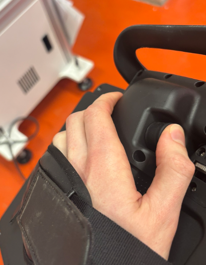

Discuss these questions with your group:

- Which robot values or parameters change when you move an axis or joint?
- How are Cartesian movements different from joint movements?
- How do `X`, `Y`, and `Z` differ from `Rx`, `Ry`, and `Rz`?

## 4. Exercise: build and run a routine

In this exercise you will create a project, record robot poses, connect the poses, and replay the routine.

### Create a project

1. Open the project menu from the tablet.

   | Open the project menu | Select the project view |
   | --- | --- |
   | 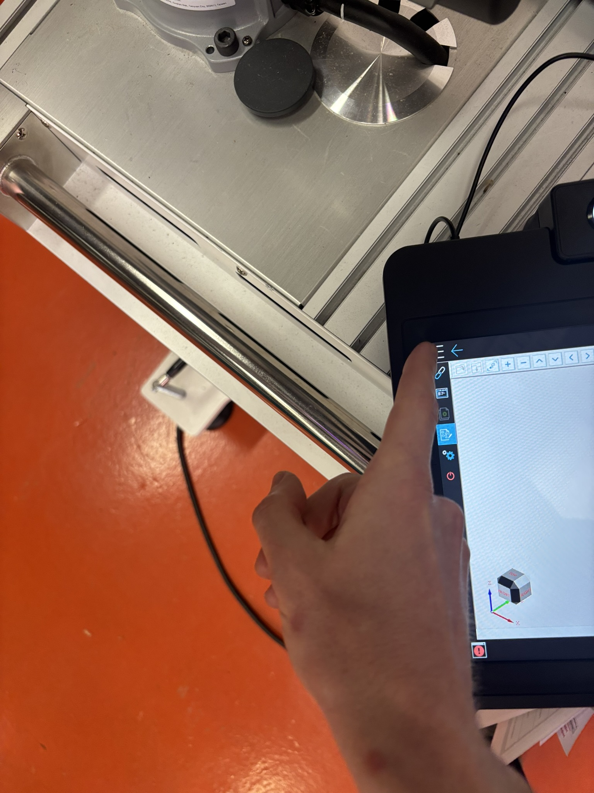 | 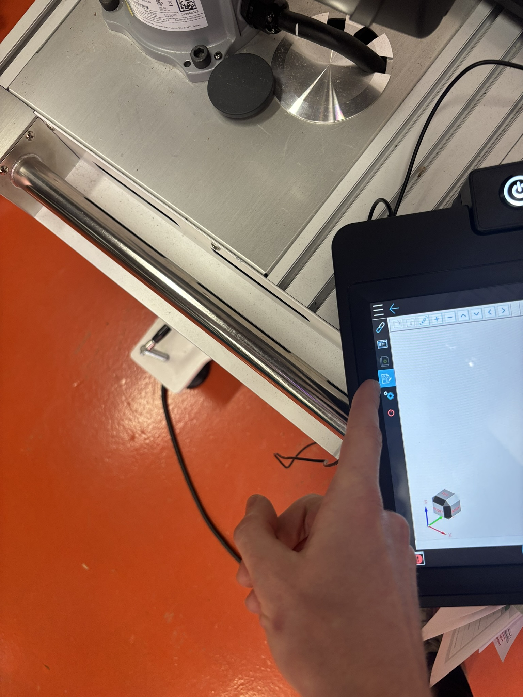 |

2. Confirm that the project workspace is open.

   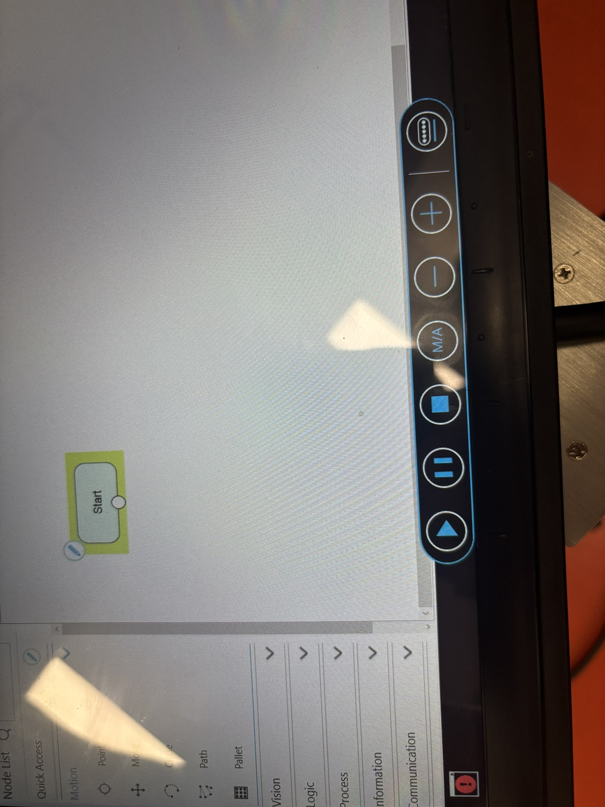

3. Select **File > New**.

   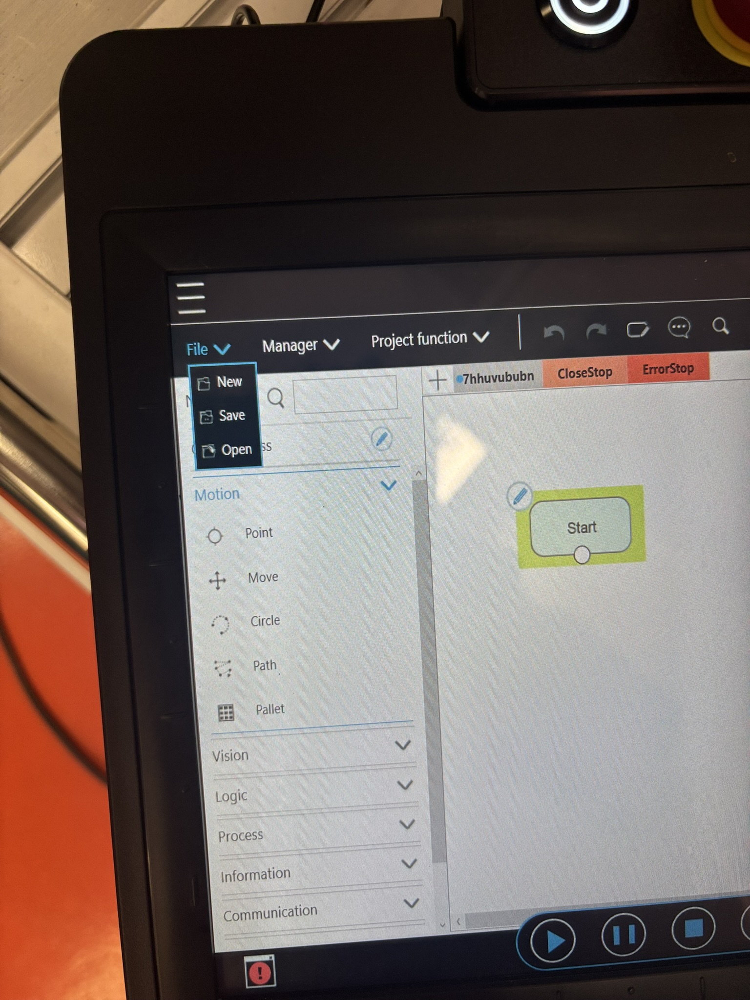

4. Enter a name for the project and confirm it.

   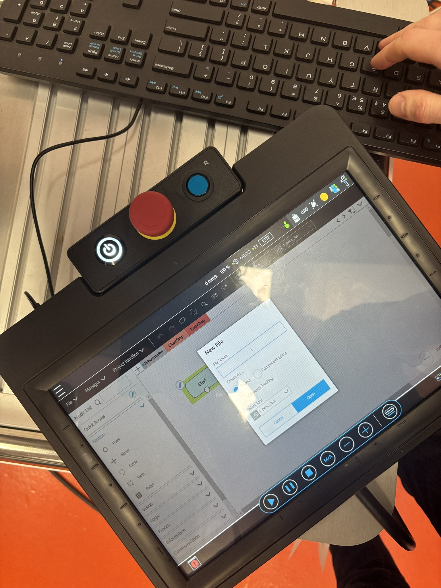

### Record poses

1. Use manual interactive mode from Section 3 to move the robot to a safe starting pose.
2. Add a point or pose to the routine.
3. Move the robot to the next pose and record it again.
4. Repeat until you have at least two poses.

   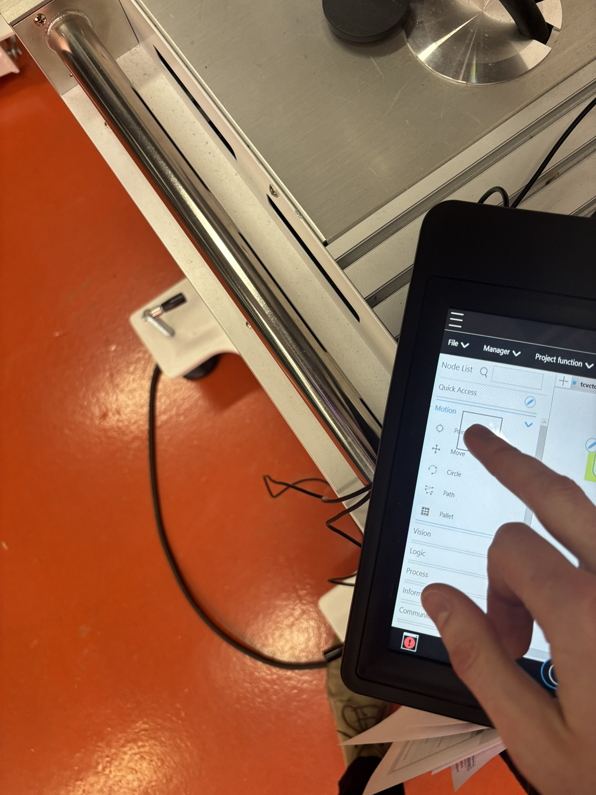

The later workshop photos show the pose and waypoint workflow:

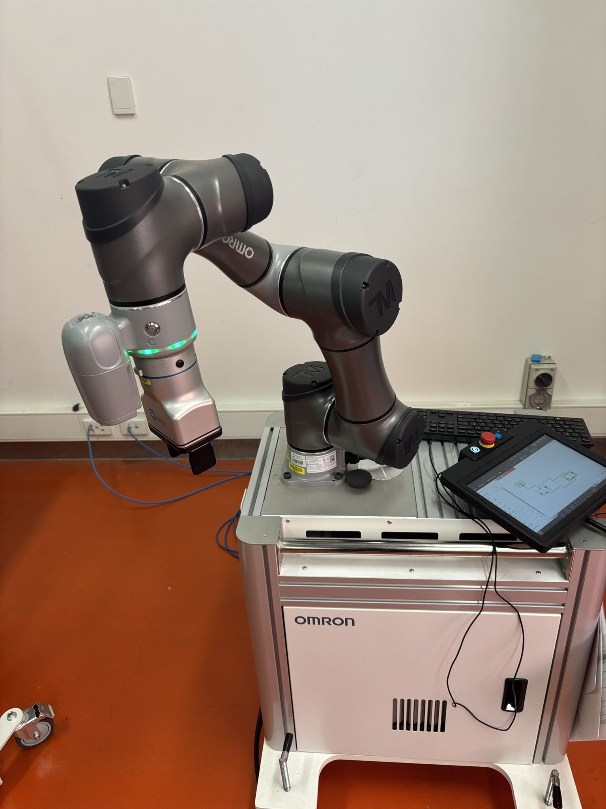

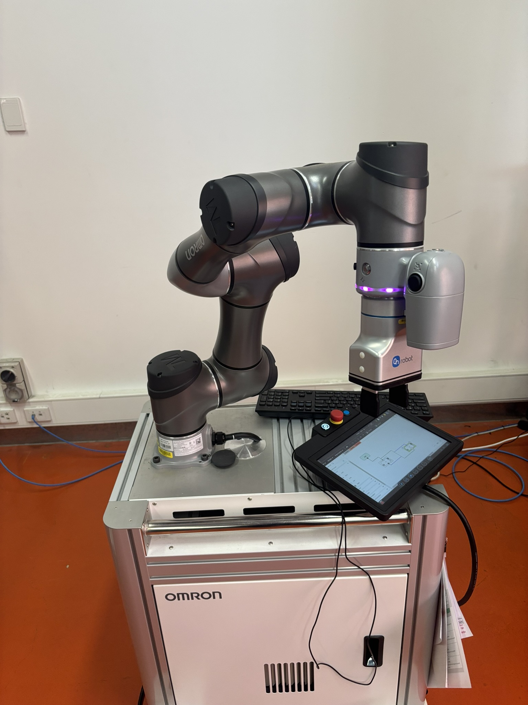

### Connect and run the routine

1. Connect the recorded points in order to make one continuous routine.

   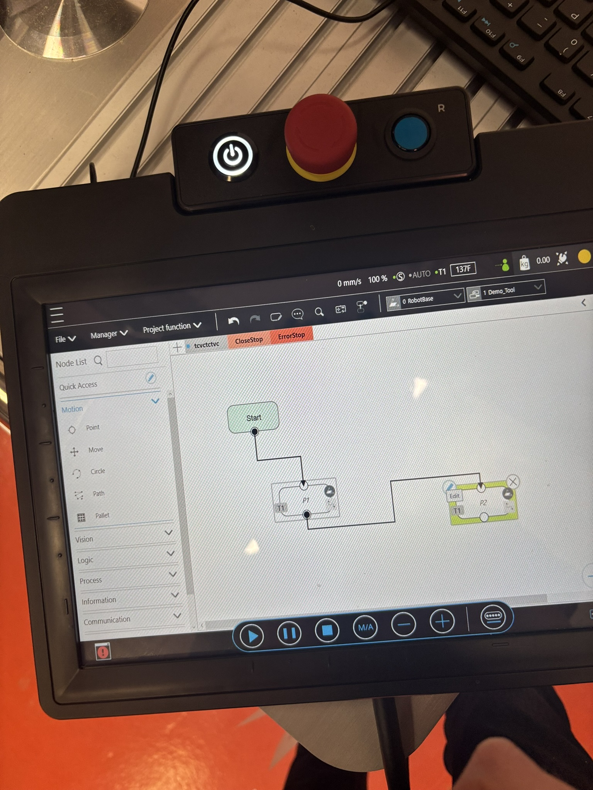

2. Drag the final connection back into the loop as shown in the example.

   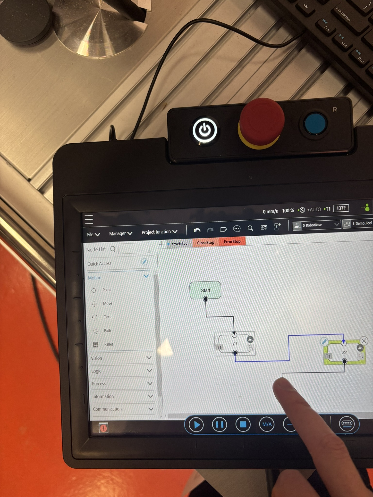

3. Press the tablet-side button halfway to enable operation.
4. Press **Play** and watch the robot replay the routine.

> Keep the emergency stop accessible and be ready to stop the robot while the routine runs.

## Completion checklist

- [ ] Robot started with the emergency stop pressed.
- [ ] Robot changed from Auto to T1 with staff supervision.
- [ ] Robot moved slowly in simulator view.
- [ ] Cartesian and joint controls were compared.
- [ ] A project was created with at least two recorded poses.
- [ ] The poses were connected and replayed safely.
