# omron_TM7S_student_workshop_guidelines
This page/repo is a guide for undergraduate students as part of unit ‘placeholder’ using the TM7S robot at RMIT's IA-Cobotics Lab.

<figure style="text-align:center">
	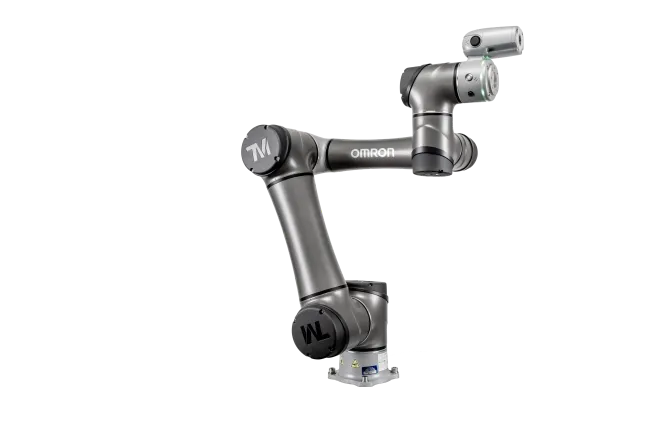
</figure>

## Step 1: Turning on the Robot Arm

First, a tablet is attached to the robotic unit as seen in *Figure 1* below. We will be using this interface to turn the robot on or off. There are a number of buttons and peripheral on the robot arm for operation. **Do not press any buttons on the tablet until this guide explicitly tells you or closely follow a staff members instruction.** 

<figure style="text-align:center">
	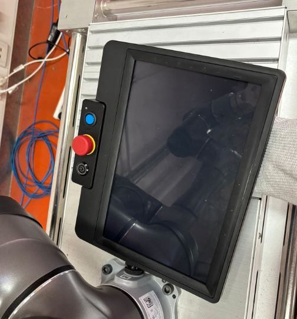
	<figcaption>Figure 1 — The Tablet Interface</figcaption>
</figure>

Before actually turning on the robot, make sure the e-stop button is enabled (big red button), you simply need to push the e-stop button down as shown in *Figure 2*.

<figure style="text-align:center">
	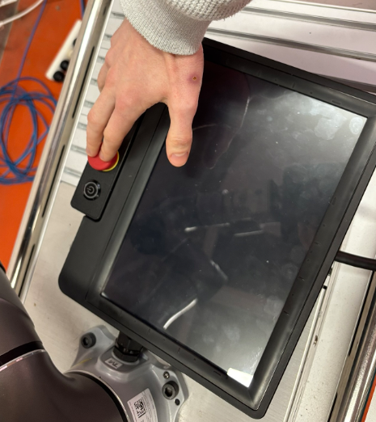
	<figcaption>Figure 2 — Enable E-stop for safety **First step before any other operation!**</figcaption>
</figure>

Assuming the e-stop is enabled, we can now safely turn on the robot. Push the power button once as shown in *Figure 3* below. The LED on the power button will light up to indicate the robot is starting the activation sequence. While booting, the tablet will display a number of images/loading screens as *Figure 4* shows.

<table>
	<tr>
		<td align="center">
			<figure style="text-align:center">
				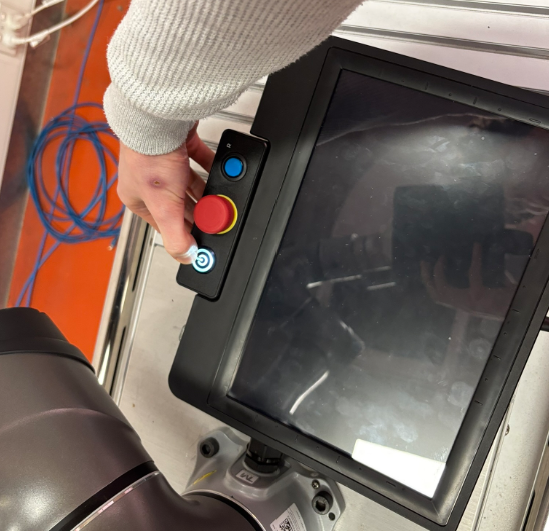
	            <figcaption>Figure 3 — Turn on the robot</figcaption>
			</figure>
		</td>
		<td align="center">
			<figure style="text-align:center">
                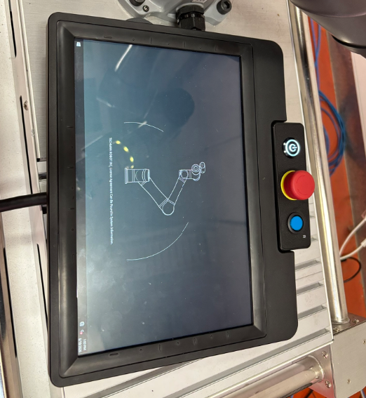
                <figcaption>Figure 4 — One of splashscreens youĺl see during boot</figcaption>
			</figure>
		</td>
	</tr>
</table>

## Step 2: Setting Up Initial Settings

After booting, the screen will show you a login screen (*Figure 5*) with a needed username and password. Please refer to the staff member present to access the username and password to proceed.

**Note: For this step a keyboard is required to be plugged in to the tablet. A USB port is available near the top left corner on the tablet (see Fig. 5 where the cable leads)**

<figure style="text-align:center">
	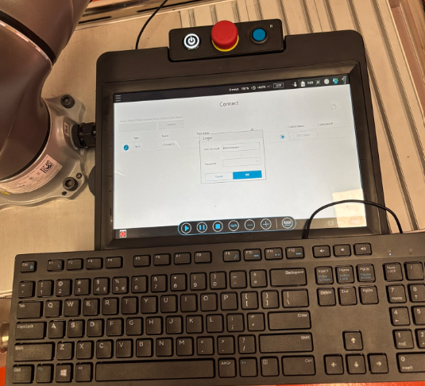
	<figcaption>Figure 5 — Login Screen</figcaption>
</figure>

You should now be looking at a screen like the one shown in *Figure 6*.

<figure style="text-align:center">
	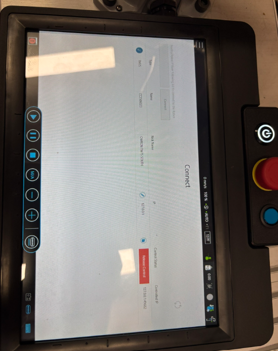
	<figcaption>Figure 6 — Tablet after logging in</figcaption>
</figure>

**IMPORTANT: The following steps are very specific so please follow along closely and ask the supervisory staff for any assistance needed.**

The robot is currently in *auto* mode. This means that right now, we cannot safely interact and easily move the robot. Look at *Figures 7/8* and see how on the bar menu (the thin horizontal bar at the top of the screen), the term **Auto** is highlighted compared to the term **T1**. 

If you look at your tablet the same status should be shown. We need to switch the robot to manual mode, where you can safely interact, move and replay motions on the robot arm.

<figure style="text-align:center">
	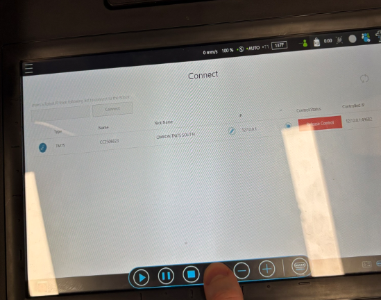
	<figcaption>Figure 7 — Status Bar at Top</figcaption>
</figure>

**Before continuing, please move a safe distance away (at least 1.5 meters), from the robot arm for the following steps. See  *Figure 8* below**

<figure style="text-align:center">
	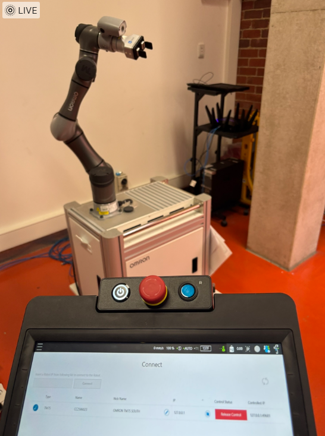
	<figcaption>Figure 8 — Expected Setup for Next Steps</figcaption>
</figure>

Once at a safe distance, we will first deactivate the e-stop. Twist the e-stop buton (*Figures 9/10*) until it pops up, thereby ensureing that the robot arm is ready for operation. The e-stop has visualisations to show you the twist direction to use.

<!-- Side-by-side: TwistOverview and Twist 2 -->
<table>
	<tr>
		<td align="center">
			<figure style="text-align:center">
				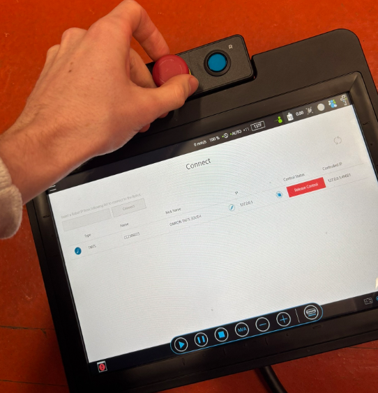
				<figcaption>Figure 9 — Twisting Motion Stage 1</figcaption>
			</figure>
		</td>
		<td align="center">
			<figure style="text-align:center">
				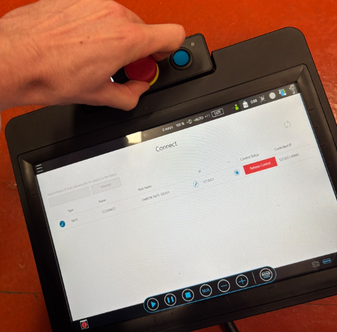
				<figcaption>Figure 10 — Twisting Motion Stage 2</figcaption>
			</figure>
		</td>
	</tr>
</table>

After the E-Stop has been disabled, we will now attempt to transition to manual mode and start moving the robot around. As shown in *Figure 11* Tap and hold the M/A button on the screen for a **minimum of 5 seconds**, HOLD UNTIL you hear a beep and the **Auto** indicator in the top menu bar should be flashing.

<figure style="text-align:center">
	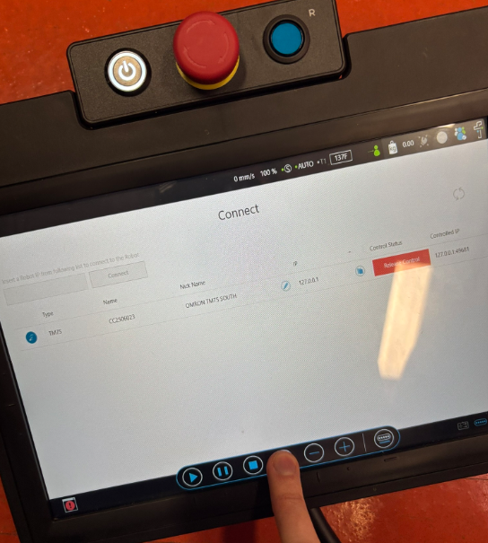
	<figcaption>Figure 11 — Press and Hold M/A</figcaption>
</figure>

**Note, IMPORTANT. READ HERE CAREFULLY**
Now, we need to key in a specific sequence, once auto is flashing press the buttons in the order of *+ , - , + , + , -* (*Figures 12/13*). Aftwewards tap M/A again followed by play (*Figures 11, followed by 14*) and you should see the manual mode active (*Figures 15*, **see how T1 is now highlighted in the top row**)

<figure style="text-align:center">
	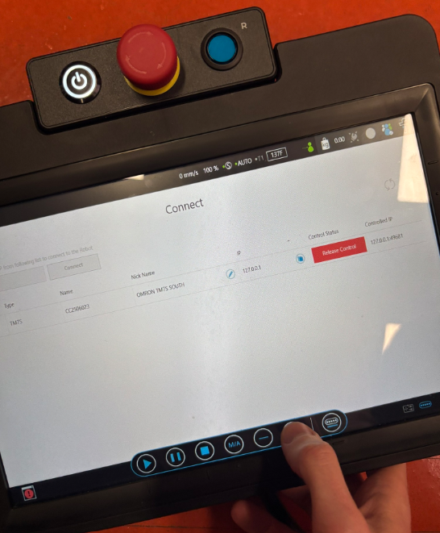
	<figcaption>Figure 12 — Pressing Plus</figcaption>
</figure>

<figure style="text-align:center">
	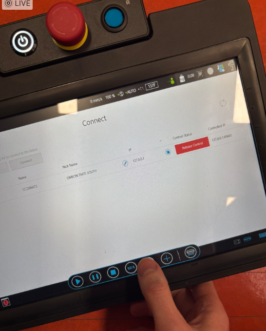
	<figcaption>Figure 13 — Pressing Negative</figcaption>
</figure>

<figure style="text-align:center">
	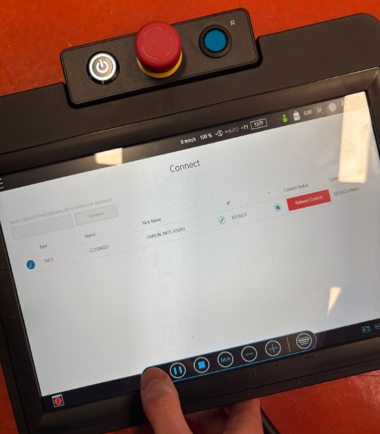
	<figcaption>Figure 14 — Pressing Play</figcaption>
</figure>

<figure style="text-align:center">
	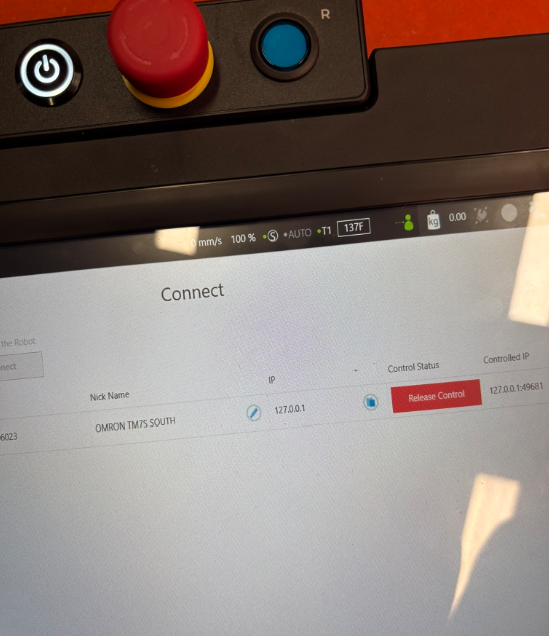
	<figcaption>Figure 15 — In Manual Mode (placeholder)</figcaption>
</figure>

**Congratulations! We are now ready to move into operating the robot in simulator view**

## Step 3: Using the Robot

Now we can move the robot in two different ways. The two subsections cover each options.

**But First...**

Move into the simulated view (*Figure 17*) by pressing the simulator view button (*Figure 16*).

<figure style="text-align:center">
	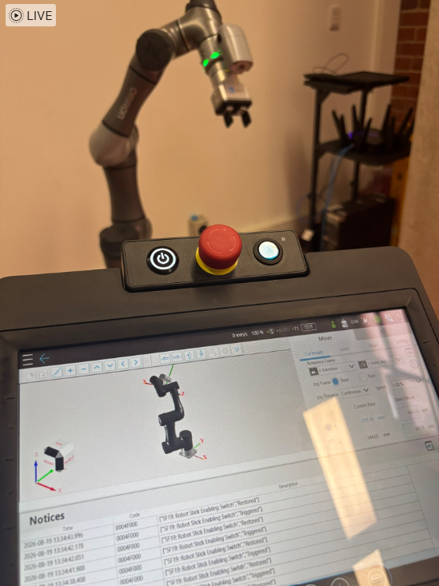
	<figcaption>Figure 17 — Robot & Simulator View</figcaption>
</figure>

### Step 3.1: Option 1 for Manipulation, Manual Interactive Mode

The easiest way is to simply activate the interactive mode. To operate this is quite simple. As shown in Figure 18, simply press the black button on the manipulator's camera. 

**However, and this is important!!**, you only need to press it halfway in. Pressing this button has two click options. Simply press it halfway before the first click. You will be able to tell if you've done it correctly by simply checking the ring around the robot's TCP. See how in *Figure 18* the ring just below the user pressing the button is bright green? That indicates that you've done this step correctly. 

**Before Proceeding: WHEN USING MANUAL MODEL MOVE THE ROBOT INCREDIBLY SLOWLY**

Assuming every step has been completed, simply hold the robot while the ring is bright green and try to **GENTLY!!** push the robot, It will follow the forces and and directions in which you push it.

<figure style="text-align:center">
	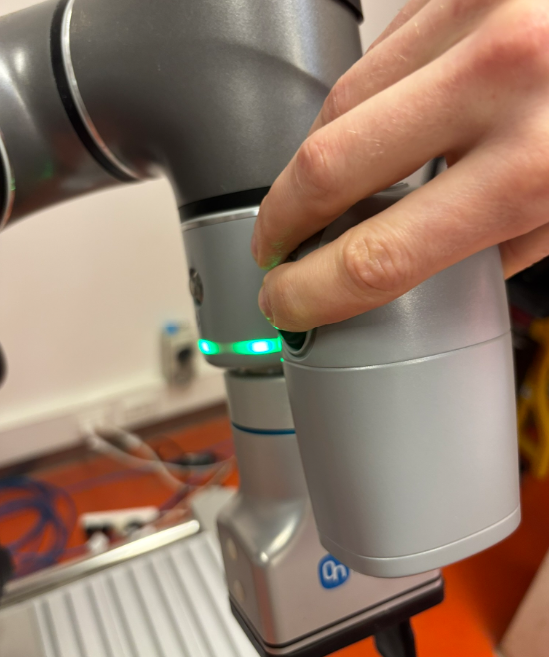
	<figcaption>Figure 18 — Hold manipulator halfway in, and slowly move the robot forward</figcaption>
</figure>

- Example: Differences between simulation and real robot views.

<figure style="text-align:center">
	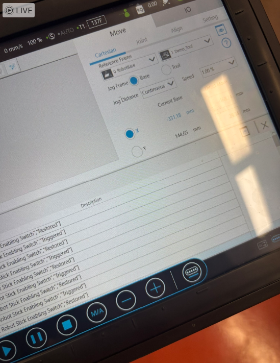
	<figcaption>Figure 19 — Motion Screen (placeholder)</figcaption>
</figure>

- Example: Motion parameters to check before running.

- Example: Safety reminder for free-range operation.

<!-- ## Notes on overlaying red circles on images

- Short answer: standard Markdown does not provide a reliable way to draw overlays (like red circles) on top of raster images across all renderers.
- Recommended: edit/annotate the images in an image editor (Photoshop, GIMP, or an annotator) for permanent, consistent results.
- Alternatives: inline SVG wrappers or HTML/CSS overlays can work in some Markdown renderers, but they are not universally supported (and platforms like GitHub sanitize some markup/styles).
- If you want, I can: produce SVG-wrapped images with red-circle annotations, or generate annotated PNGs for you.

---

If you want different image heights, captions, or automatic numbering, tell me which height (px) and I will update the file. -->
